# Analysis of Refactoring VBA code and Performance Measurement

## Overview
The purpose of this project was to help Steve, a recent college graduate in Finance, analyze several green energy stocks for his parents. Through the Module 2: VBA of Wall Street class activities, we created the original VBA code to list the stock ticker, total daily volume, and return for each stock in a given data set by simply clicking a button. However, Steve now wants to expand the dataset to include the entire stock market, which can take some time to execute using the original VBA code. Therefore, by refactoring the original VBA code through this project, we are hoping to make it more efficient and easier for Steve, and future users, to read. Both versions of the VBA code perform the following: 
1.	The user runs the macro 
2.	The user enters a year 
3.	The output is populated 
4.	A pop-up box informs the user of the number of seconds for which the code ran

In the document below "Original Code" refers to the VBA code for the AllStocksAnalysis() macro in Module 1 of the VBA_Challenge.xlsm file. "Refactored Code" refers to the VBA code for the Sub AllStocksAnalysisRefactored() in Module 2 of the VBA_Challenge.xlsm file

## Results 

### Analysis

Both the original and refactored code create variables for the start and end time for the timer, create and initialize a variable to store the users year input within the box, start the timer to start counting number seconds the code runs, set the value of cell A1 to a title for the output which is All Stocks and the Year entered by the user, set the values of cells C1 to C3 to be the header row for the output: Ticker, Total Daily Volume, and Return, initialize an array for the tickers, and gets the number of rows to loop through. 

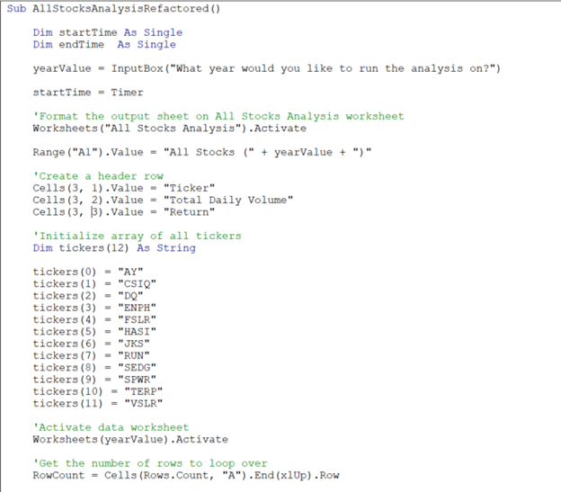

#### Original Code Analysis

The original code utilizes nested For loops as you can see in the image below. The code in the outer For i loop starts by setting the value of the ticker variable to corresponding value in the ticker array. It also sets the initial value of the totalVolume variable to 0. The inner For j loop will loop through each row of the Data worksheet. First, the code inside this loop compares the value of the ticker array set in the outer loop to the value of the ticker cell in the Data worksheet. If the values match, the totalVolume variable is increased by the value of the Volume cell in the data worksheet. Second, a condition is used to determine and set the value of the startingPrice variable. Finally, a third condition is used to determine and set the value of the ending price. This ends the inner (*j*) loop. 

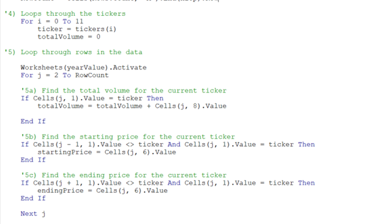

After the inner loop ends, the code continues in the outer loop to generate the output. This loop will repeat 12 times for each of the ticker symbols in the ticker array. This now ends the outer (*i*) loop.

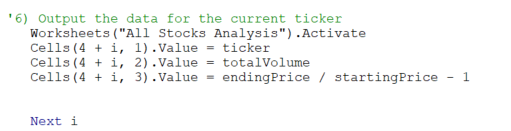

Finally, the endTime variable is set to Timer in order to stop counting the number of seconds the code ran and a message box is set to display the number of seconds the code ran.   

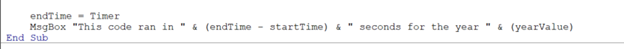

#### Refactored Code Analysis

The Refactored code utilizes multiple arrays and For loops. The code starts by creating a variable for tickerIndex and three output arrays. 

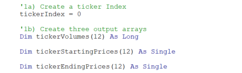

In the second step, the refactored code creates a loop to initialize the value of the tickerVolume array. This creates 12 ticker volumes and sets the starting value for each to 0. The second loop in this step loops through each row of the data worksheet to update values of the arrays. 

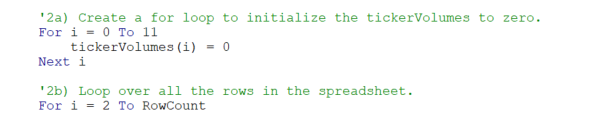

Within the second loop above, the tickerVolume variable in increased by the value of the volume cell in the data worksheet for the corresponding tickerIndex.  Then, a condition is used to determine and sets the value of the tickerStartingPrice variable. Finally, another condition is used to determine and sets the value of the ending price and increase the tickerIndex after the row of the tickerEndingPrice. This ends the second loop. 

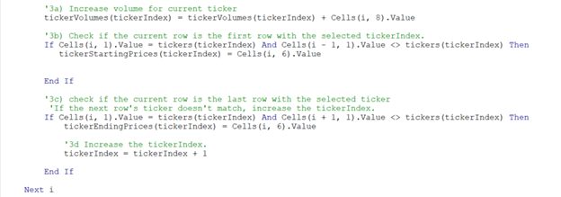

As shown in Step 4 below, the refactored code contains a third loop that loops through each of the arrays that will display their output. 

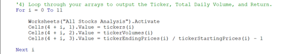

Next, the refactored code contains the code for static and conditional formatting within the same macro, unlike the original code where it is created as a separate Subroutine.

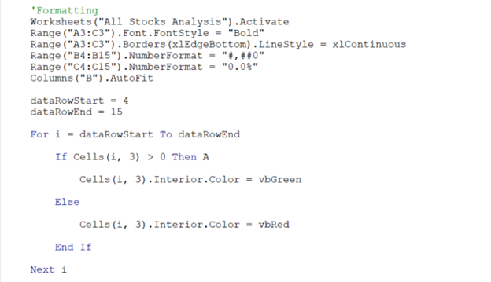

Finally, the Refactored code includes the endTime variable, which is set to time to stop counting the number of seconds the code ran, and a message box is set to display the runtime.
 
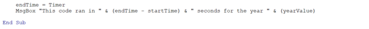

### Execution Times

#### Original Code 2017 Runtime
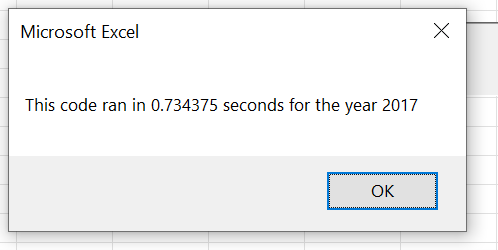

#### Refactored Code 2017 Runtime
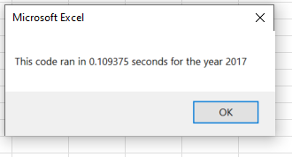

#### Original Code 2018 Runtime
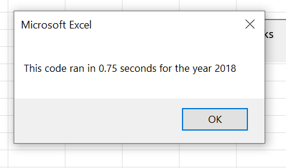

#### Refactored Code 2018 Runtime

## Summary

### Advantages 
A general advantage of refactoring code is improved performance and increased scalability. In this example, we do see significant improvement to run times for 2017 and 2018 data in the refactored code. This may be because in the original code, the code loops through each row of the data set 12 times for each ticker symbol. In the refactored code, each row of the data set is only looped through once. This makes it easier to understand what the code is doing and executes the program faster.

### Disadvantages  
A general disadvantage of refactoring code is the amount of time it takes to rewrite working code. This could also mean more costs and risks involved. Does the amount of time saved in running the code provide greater value than the time spent refactoring the code? For this instance, the benefit may prove to be more efficient and easier to understand. Given the large number of stocks that Steve (or someone else) may want to analyze, refactoring the code may be time well-spent to increase efficiency and ease of use since we are working with an existing code that works rather quickly. However, in some cases incorrect refactoring can lead to new errors and bugs in the code, which can be more time-consuming.
